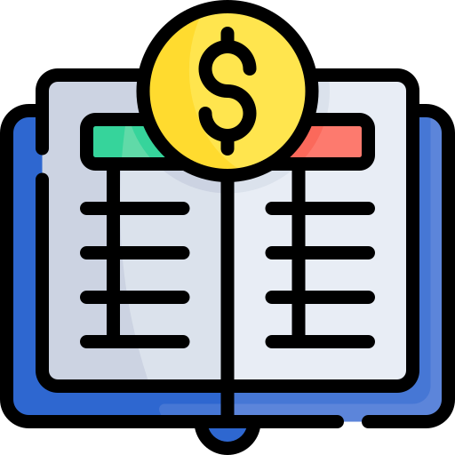
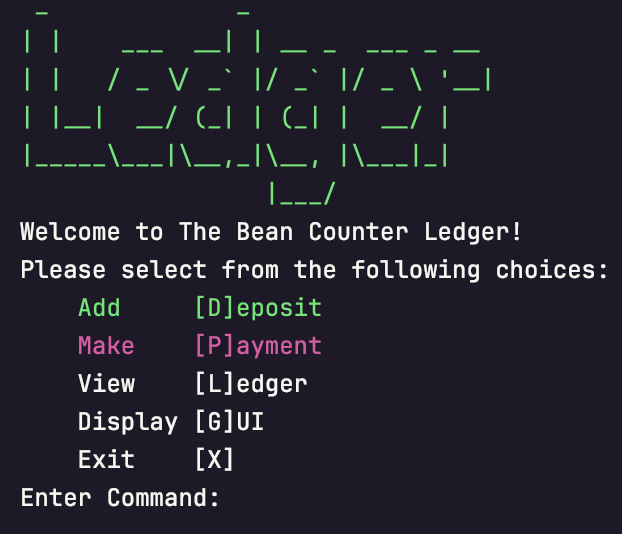
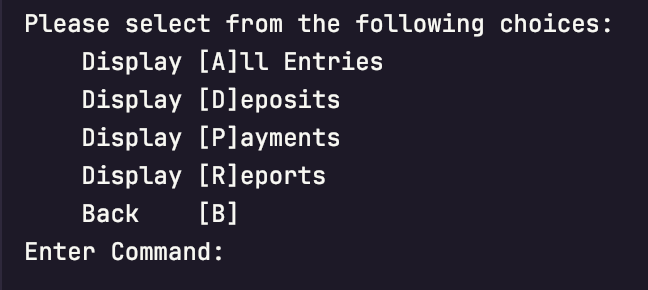
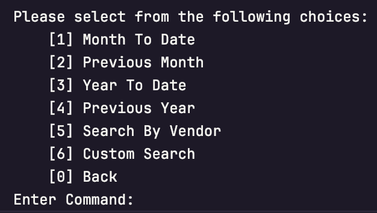
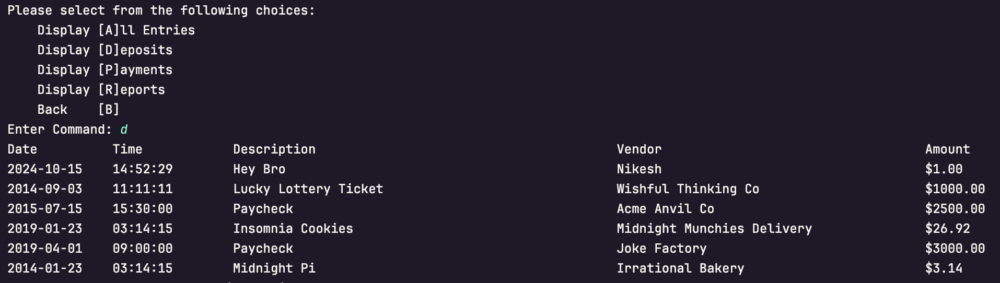
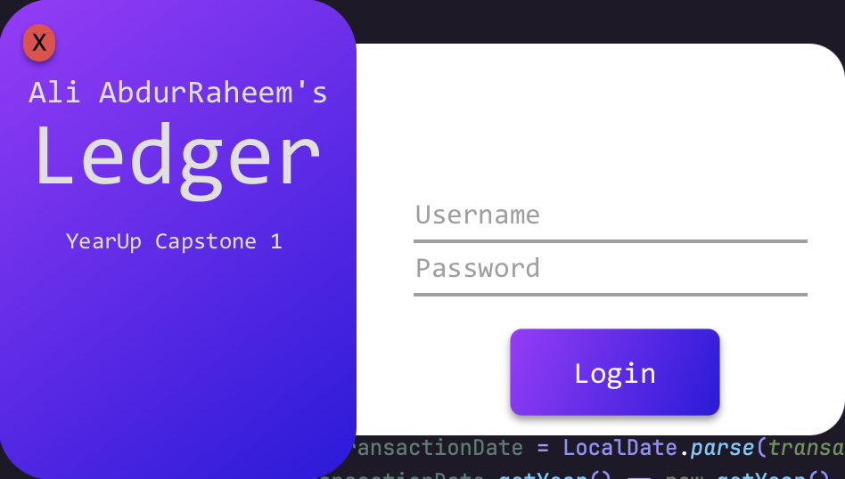
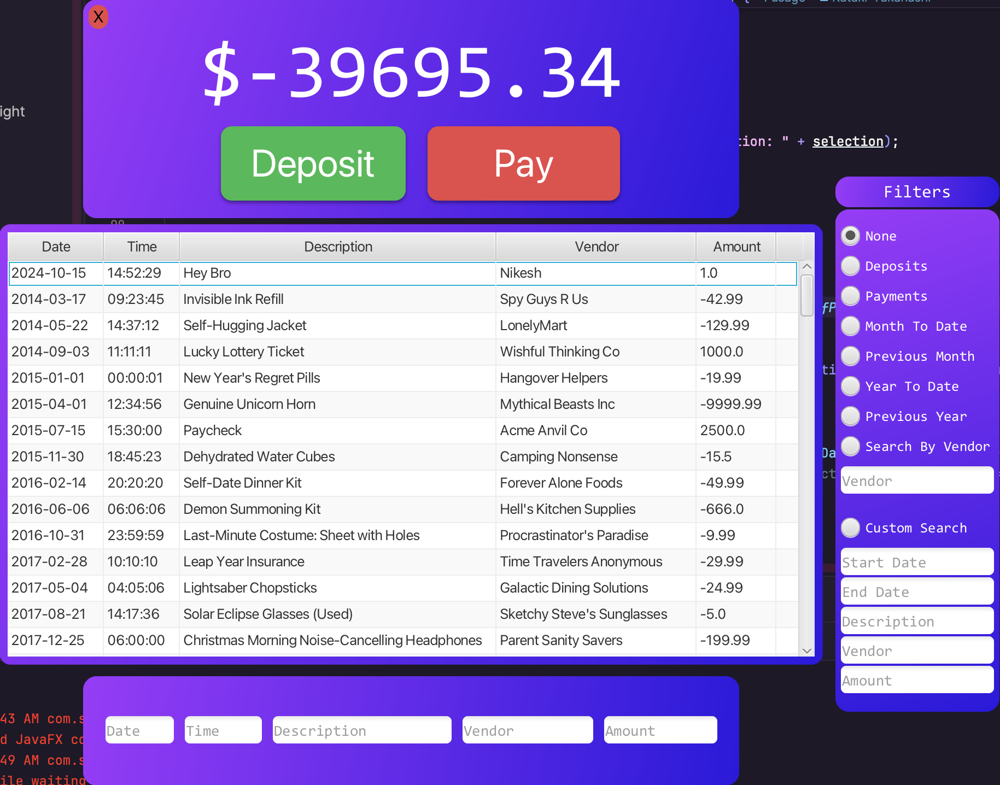

<p align="center">
  
</p>

<h1 align="center">The Bean Counter Ledger</h1>

<p align="center">
    
    <a href="https://wakatime.com/badge/user/018d6ba0-92b9-4fd1-bdc3-7c0f7b3f179c/project/ccdc5d8d-c55f-47ce-a283-1df113eefa3a">
        
    </a>
    
</p>


---

### Project Overview

This is a simple ledger application I built as my YearUp capstone #1 project. 
The app can read a `transactions.csv` file, add deposits or payments, and display a ledger of all transactions. 
It also allows you to filter the transactions based on different criteria, like deposits, payments, or custom searches.

---

### Screenshots



*Screenshot of the Home Screen.*




*Screenshot of the Ledger Screen.*




*Screenshot of the Report Screen.*




*Example output for the Deposits option in the Home Screen.*

---

### GUI Screenshots

---


*Screenshot of Login Screen using JavaFX and CSS*




*Screenshot of Login Screen Fields this appears after an animation with JavaFX and CSS*




*Screenshot of Main Screen it functions the same as the text version*

---

### Code Highlight

One of the key features in my app is the ability to perform a **custom search** on transactions using different filters 
such as start date, end date, description, vendor, and amount. Here’s the customSearch function that accomplishes this:

```java
public static List<Transactions.Transaction> customSearch(List<Transactions.Transaction> transactions,
                                                                  String startDateString, String endDateString,
                                                                  String description, String vendor, String inputDouble) {
    List<Transactions.Transaction> resultList = transactions;
    DateTimeFormatter formatter = DateTimeFormatter.ofPattern("yyyy-MM-dd");

    // Get Start date
    if (!startDateString.isBlank()) {
        LocalDate startDate = LocalDate.parse(startDateString, formatter);

        // Use stream to filter transactions by start date
        resultList = resultList.stream()
                .filter(transaction -> {
                    LocalDate transactionDate = LocalDate.parse(transaction.getDate(), formatter);
                    return transactionDate.isAfter(startDate);
                }).collect(Collectors.toList());
    }

    // Get End Date
    if (!endDateString.isBlank()) {
        LocalDate endDate = LocalDate.parse(endDateString, formatter);

        // Use stream to filter transactions by end date
        resultList = resultList.stream()
                .filter(transaction -> {
                    LocalDate transactionDate = LocalDate.parse(transaction.getDate(), formatter);
                    return transactionDate.isBefore(endDate);
                }).collect(Collectors.toList());
    }

    // Get Description
    if (!description.isBlank()) {
        resultList = resultList.stream().filter(transaction -> {
            return transaction.getDescription().equals(description);
        }).collect(Collectors.toList());
    }

    // Get Vendor
    if (!vendor.isBlank()) {
        resultList = resultList.stream().filter(transaction -> {
            return transaction.getVendor().equals(vendor);
        }).collect(Collectors.toList());
    }

    // Get Amount
    if (!inputDouble.isBlank()) {
        double amount = Double.parseDouble(inputDouble);
        resultList = resultList.stream().filter(transaction -> {
            return transaction.getAmount() == amount;
        }).collect(Collectors.toList());
    }

    return resultList;
}

```
